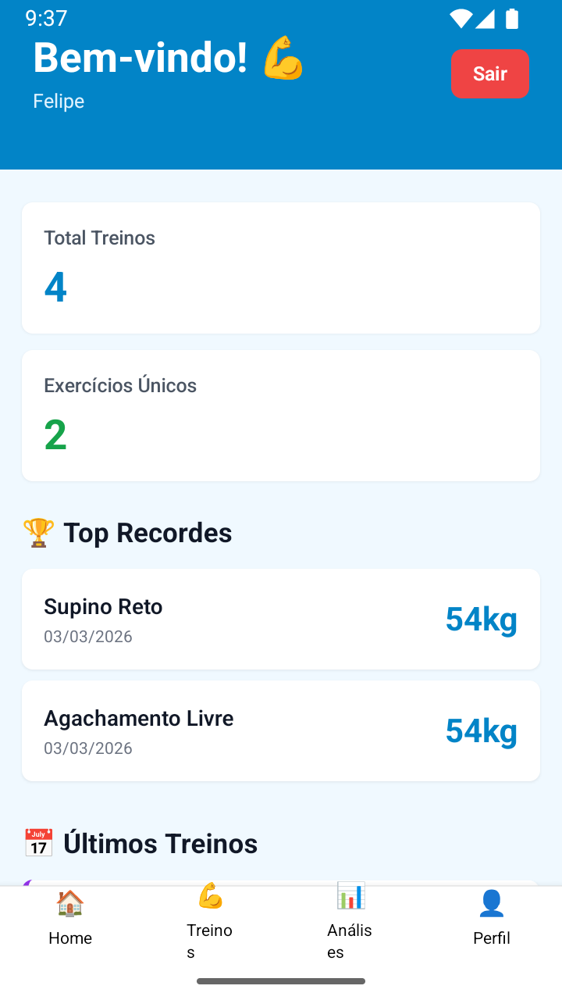
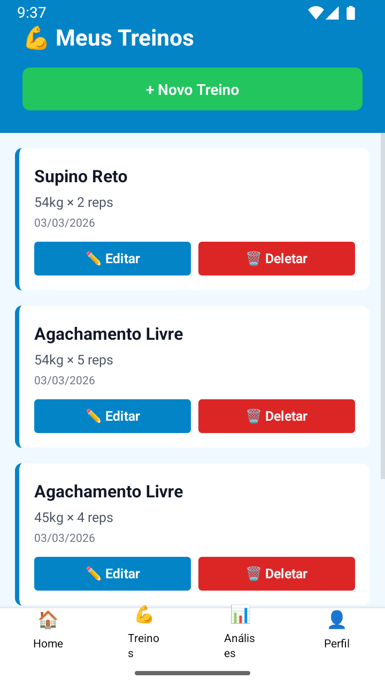
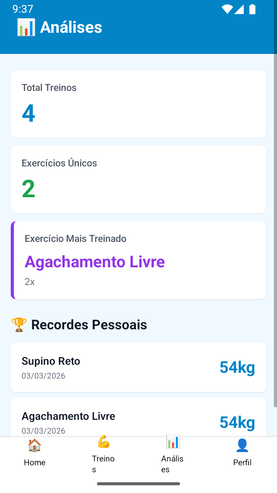

# 🏋️ CargaLog - Plataforma Completa

<div align="center">

[🇧🇷 Português](README.md) | [🇺🇸 English](README_EN.md)

**Plataforma profissional de rastreamento de progressão de treinos com Clean Architecture**


</div>

---

## 📋 Índice

- [Sobre o Projeto](#sobre-o-projeto)
- [Galeria Visual](#-galeria-visual)
- [Características](#características-principais)
- [Arquitetura](#arquitetura)
- [Stack Tecnológico](#stack-tecnológico)
- [Projetos](#estrutura-dos-projetos)
- [Como Começar](#como-começar)
- [Documentação](#documentação)
- [Status](#status-do-projeto)

---

## Sobre o Projeto

**CargaLog** é uma plataforma enterprise para rastreamento de progressão de treinos de musculação. Desenvolvida com **Clean Architecture**, **Domain-Driven Design (DDD)** e princípios **SOLID**, oferece uma experiência integrada entre:

- 🖥️ **Backend robusto** com API REST escalável
- 🌐 **Web responsivo** com dashboard moderno
- 📱 **App nativo** para iOS e Android

### 🎯 Objetivo
Permitir que atletas, personal trainers e academias registrem, analisem e acompanhem a evolução de carga em tempo real através de múltiplos dispositivos com sincronização automática e segura.

### ✨ Características Principais

#### 🔐 Segurança
- ✅ Autenticação JWT com expiração configurável
- ✅ Criptografia de senhas com bcrypt (10 rounds)
- ✅ Validação de entrada em todas as rotas
- ✅ CORS configurado para produção
- ✅ Rate limiting e proteção contra ataque

#### 🏋️ Funcionalidades
- ✅ Registro de treinos com validações robustas
- ✅ Histórico completo de exercícios
- ✅ Cálculo automático de carga máxima e volume
- ✅ Filtros avançados por período, exercício, etc.
- ✅ Comparação de progressão entre treinos

#### 📊 Análises
- ✅ Estatísticas gerais do usuário
- ✅ Gráficos de progressão de carga
- ✅ Ranking de exercícios mais treinados
- ✅ Relatórios personalizados
- ✅ Exportação de dados

#### 🔄 Sincronização
- ✅ Sincronização em tempo real entre dispositivos
- ✅ Offline-first no mobile
- ✅ Conflito resolution automático
- ✅ Backup automático na nuvem

---

## 📸 Galeria Visual

<div align="center">
  
  
  
  
  
  
  
  
  
  
  
  
  
  
  
  
  
  
  
  
</div>

---

## Arquitetura

### Clean Architecture + DDD

O projeto segue uma arquitetura limpa com camadas bem definidas:

```
┌─────────────────────────────────────────┐
│        Apresentação (Web/Mobile)        │
├─────────────────────────────────────────┤
│  Interface Adapters (Controllers/API)   │
├─────────────────────────────────────────┤
│     Application (Use Cases/Services)    │
├─────────────────────────────────────────┤
│    Domain (Entities/Value Objects)      │
├─────────────────────────────────────────┤
│  Frameworks & Drivers (DB/HTTP/Auth)    │
└─────────────────────────────────────────┘
```

### Princípios SOLID

- **S**RP: Cada classe tem uma única responsabilidade
- **O**CP: Aberto para extensão, fechado para modificação
- **L**SP: Subtypes substituem base types sem quebrar
- **I**SP: Interfaces específicas, não genéricas
- **D**IP: Dependência em abstrações, não em concretos

---

## Stack Tecnológico

### 📘 Backend
```json
{
  "runtime": "Node.js 22",
  "framework": "NestJS 11",
  "adapter": "FastifyAdapter",
  "database": "PostgreSQL 15",
  "orm": "TypeORM",
  "auth": "JWT + Passport",
  "validation": "Class-validator",
  "logging": "Winston + Audit Log",
  "apiDocs": "Swagger/OpenAPI",
  "testing": "Vitest (305 tests)",
  "containerization": "Docker & Docker Compose"
}
```

### 🌐 Frontend Web
```json
{
  "library": "React 19",
  "language": "TypeScript",
  "buildTool": "Vite 8",
  "styling": "Tailwind CSS 4",
  "httpClient": "Axios",
  "routing": "React Router",
  "stateManagement": "Context API + Hooks",
  "charts": "Recharts",
  "packager": "npm"
}
```

### 📱 Mobile
```json
{
  "framework": "React Native 0.84",
  "platform": "React Native CLI",
  "language": "TypeScript",
  "styling": "NativeWind (Tailwind CSS)",
  "navigation": "React Navigation",
  "storage": "AsyncStorage",
  "httpClient": "Axios",
  "stateManagement": "Context API",
  "testing": "Vitest (13 tests)",
  "packager": "npm"
}
```

---

## Estrutura dos Projetos

### 📁 Diretório Raiz

```
CargaLog/
├── 📘 backend/                    # API REST (NestJS)
│   ├── src/
│   │   ├── domain/               # Entidades, Value Objects, Repositórios
│   │   ├── application/          # Use Cases, DTOs
│   │   ├── interface-adapters/   # Controllers, Repositories Impl
│   │   ├── frameworks/           # NestJS Modules, TypeORM
│   │   └── shared/               # Decorators, Filters, Services
│   ├── test/                     # Testes E2E
│   ├── Dockerfile
│   ├── docker-compose.yml
│   ├── package.json
│   ├── README.md                 # 📖 Documentação Detalhada
│   └── README_EN.md
│
├── 🌐 frontend/                  # Dashboard Web (React + Vite)
│   ├── src/
│   │   ├── api/                  # HTTP clients
│   │   ├── pages/                # Componentes de página
│   │   ├── components/           # Componentes reutilizáveis
│   │   ├── hooks/                # Custom Hooks
│   │   ├── contexts/             # Context API
│   │   ├── utils/                # Utilitários
│   │   └── styles/               # CSS Global + Tailwind
│   ├── public/                   # Assets estáticos
│   ├── package.json
│   ├── vite.config.ts
│   ├── tailwind.config.js
│   ├── README.md                 # 📖 Documentação Detalhada
│   └── README_EN.md
│
├── 📱 mobile/                    # App Nativo (React Native)
│   ├── src/
│   │   ├── screens/              # Telas do app
│   │   ├── components/           # Componentes RN
│   │   ├── navigation/           # React Navigation
│   │   ├── api/                  # HTTP clients
│   │   ├── contexts/             # Context API
│   │   ├── hooks/                # Custom Hooks
│   │   └── utils/                # Utilitários
│   ├── app.json
│   ├── babel.config.js
│   ├── metro.config.js
│   ├── tailwind.config.js
│   ├── package.json
│   ├── README.md                 # 📖 Documentação Detalhada
│   └── README_EN.md
│
├── 📋 ARCHITECTURE.md            # 🏗️ Detalhes arquitetura completa
├── 📄 README.md                  # Este arquivo
├── 📄 README_EN.md               # English version
├── 📋 IDEAS.md                   # Roadmap e ideias futuras
├── 📋 LICENSE                    # MIT License
└── 📋 next-steps.txt             # Próximas ações
```

---

## Como Começar

### Pré-requisitos

```bash
# Verificar versões mínimas
node --version          # v22.0.0+
npm --version          # v10.0.0+
git --version          # 2.30+

# Ferramentas opcionais
docker --version       # Para containerização
postgresql --version   # Se usar local (caso contrário use Docker)
```

### Instalação Rápida

#### 1. Clone o repositório
```bash
git clone https://github.com/seu-usuario/cargalog.git
cd CargaLog
```

#### 2. Backend (Node + PostgreSQL)

```bash
cd backend

# Instalar dependências
npm install

# Configurar ambiente
cp .env.example .env

# Migrations do banco (ou usar docker-compose)
npm run migration:run

# Iniciar servidor
npm run start:dev
```

**Acesso:** `http://localhost:3000`
**Documentação:** `http://localhost:3000/api`

#### 3. Frontend Web

```bash
cd frontend

# Instalar dependências
npm install

# Iniciar desenvolvimento
npm run dev
```

**Acesso:** `http://localhost:5173`

#### 4. Mobile App

```bash
cd mobile

# Instalar dependências
npm install

# Terminal 1
npm run start

# Terminal 2 (Android)
npm run android

# Terminal 2 (iOS - macOS)
npm run ios
```

### Com Docker (Recomendado)

```bash
# Na raiz do projeto
cd backend

# Build e iniciar
docker-compose up -d

# Migrations automáticas
npm run migration:run
```

---

## Documentação

### 📚 Documentação Detalhada por Projeto

- **[Backend](./backend/README.md)** - API REST, autenticação, banco de dados
- **[Frontend](./frontend/README.md)** - Dashboard web, componentes, estado
- **[Mobile](./mobile/README.md)** - App nativo, sincronização, offline

### 📐 Arquitetura

- **[ARCHITECTURE.md](./ARCHITECTURE.md)** - Clean Architecture, DDD, SOLID
- **[IDEAS.md](./ideas.txt)** - Roadmap e funcionalidades futuras

### 🔗 Links Úteis

- [API Docs (Swagger)](http://localhost:3000/api) - Após iniciar backend
- [NestJS Docs](https://docs.nestjs.com)
- [React Docs](https://react.dev)
- [React Native Docs](https://reactnative.dev)
- [Clean Architecture](https://blog.cleancoder.com/uncle-bob/2012/08/13/the-clean-architecture.html)
- [DDD Fundamentals](https://www.domainlanguage.com/ddd/)

---

## Status do Projeto

### ✅ Concluído

- [x] Backend API completa com CRUD
- [x] Autenticação com JWT
- [x] Validações e tratamento de erro
- [x] Testes unitários e E2E (Backend: 305, Frontend: 31, Mobile: 13)
- [x] Documentação API Swagger/OpenAPI
- [x] Logging com Winston + Audit Log no banco
- [x] Docker setup completo
- [x] Clean Architecture implementada

### 🔄 Em Desenvolvimento

- [ ] Frontend web - Dashboard interativo
- [ ] Mobile app - Sincronização real-time
- [ ] Gráficos avançados
- [ ] Notificações push
- [ ] Biometria no mobile

### 📋 Roadmap

- [ ] Sistema de grupos e competições
- [ ] Integração com wearables
- [ ] IA para recomendações de treino
- [ ] Marketplace de planos de treino
- [ ] Certificação de Personal Trainers
- [ ] Versão desktop (Electron)

---

## 🤝 Contribuindo

1. Fork o projeto
2. Crie uma branch (`git checkout -b feature/MinhaFeature`)
3. Commit suas mudanças (`git commit -m 'Add: nova feature'`)
4. Push para a branch (`git push origin feature/MinhaFeature`)
5. Abra um Pull Request

### Regras de Commit

- Use conventional commits: `feat:`, `fix:`, `docs:`, `refactor:`
- Exemplo: `feat(backend): adicionar validação de carga`
