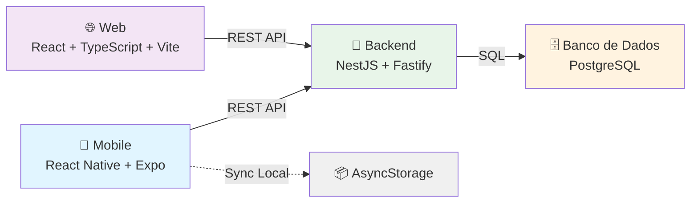

# CargaLog
# 🏋️ CargaLog - Aplicação Completa

<div align="center">

[🇧🇷 Português](README.md) | [🇺🇸 English](README_EN.md)

**Plataforma completa de rastreamento de progressão de treinos: Backend, Web e Mobile**


</div>

---

## 📋 Índice

- [Sobre o Projeto](#-sobre-o-projeto)
- [Tecnologias](#-tecnologias)
- [Projetos](#-projetos)
- [Como Começar](#-como-começar)
- [Documentação](#-documentação)
- [Progresso](#-progresso-do-projeto)

---

## 📝 Sobre o Projeto

**CargaLog** é uma plataforma completa para rastreamento de progressão de treinos de musculação. Desenvolvida com arquitetura moderna (Clean Architecture + DDD) e princípios SOLID, oferece uma experiência perfeita entre backend, web e mobile.

### Objetivo
Permitir que atletas registrem, analisem e acompanhem sua evolução em tempo real através de múltiplos dispositivos com sincronização automática.

### Principais Características
- ✅ **Autenticação segura** com JWT e bcrypt
- ✅ **Registro de treinos** com validações robustas
- ✅ **Análise de progressão** com gráficos interativos
- ✅ **Sincronização** em tempo real entre plataformas
- ✅ **Interface responsiva** em web e mobile
- ✅ **Testes automatizados** com alta cobertura (305 testes)
- ✅ **Clean Architecture** e SOLID principles
- ✅ **API REST** documentada e pronta para produção

---

## 🛠️ Tecnologias

### 📘 Backend
- **NestJS 11** - Framework progressive Node.js
- **FastifyAdapter** - Alta performance e escalabilidade
- **TypeORM** - ORM com migrations versionadas
- **PostgreSQL** - Banco de dados relacional
- **JWT + Passport** - Autenticação segura
- **Winston** - Logging estruturado
- **Jest** - 305 testes unitários (71% cobertura)

### 🌐 Frontend Web
- **React 18** - UI Library moderna
- **TypeScript** - Tipagem estática completa
- **Vite** - Build tool ultrarrápido
- **Tailwind CSS** - Utility-first CSS
- **Axios** - HTTP client
- **React Router** - Roteamento SPA
- **Recharts** - Gráficos interativos

### 📱 Mobile
- **React Native** - Framework multiplataforma
- **Expo** - Plataforma de desenvolvimento
- **React Navigation** - Navegação nativa
- **AsyncStorage** - Persistência de dados
- **Redux** - State management
- **Axios** - HTTP client sincronizado

---

## 📁 Projetos

```
CargaLog/
├── 📘 backend/
│   ├── src/
│   │   ├── domain/                 # DDD - Entidades, VOs
│   │   ├── application/            # Use cases
│   │   ├── interface-adapters/     # Controllers, Repositories
│   │   ├── frameworks/             # NestJS, TypeORM
│   │   └── shared/                 # Serviços compartilhados
│   ├── test/                       # Testes E2E
│   ├── package.json
│   ├── README.md (Português) ✅
│   └── README_EN.md (Inglês) ✅
│   └── ✅ PRONTO PARA PRODUÇÃO
│
├── 🌐 frontend/
│   ├── src/
│   │   ├── api/                    # HTTP client
│   │   ├── pages/                  # Páginas SPA
│   │   ├── components/             # Componentes React
│   │   ├── hooks/                  # Custom hooks
│   │   ├── contexts/               # Context API
│   │   └── styles/                 # Tailwind CSS
│   ├── package.json
│   ├── README.md (Português) ✅
│   └── README_EN.md (Inglês) ✅
│   └── 🔄 Em desenvolvimento
│
└── 📱 mobile/
    ├── app/
    │   ├── screens/                # Telas React Native
    │   ├── components/             # Componentes RN
    │   ├── navigation/             # React Navigation
    │   ├── api/                    # HTTP client
    │   ├── store/                  # Redux slices
    │   └── hooks/                  # Custom hooks
    ├── package.json
    ├── README.md (Português) ✅
    └── README_EN.md (Inglês) ✅
    └── 🔄 Em desenvolvimento
```

---

## 🚀 Como Começar

### Pré-requisitos Globais
- **Node.js 18+** - Runtime JavaScript
- **npm ou yarn** - Gerenciador de pacotes
- **Git** - Controle de versão
- **Conta Supabase** (opcional - pode usar PostgreSQL local)

### Instalação Rápida

#### 1. Clone o repositório
```bash
git clone <URL_DO_REPOSITORIO>
cd CargaLog
```

#### 2. Backend (Pronto para usar)
```bash
cd backend
npm install
cp .env.example .env
# Edite .env com suas credenciais Supabase
npm run migration:run
npm run start:dev
# API disponível em http://localhost:3000/api/v1
```

#### 3. Frontend Web (Base estruturada)
```bash
cd ../frontend
npm install
cp .env.example .env
npm run dev
# App disponível em http://localhost:5173
```

#### 4. Mobile (Base estruturada)
```bash
cd ../mobile
npm install
cp .env.example .env
expo start
# Escanear QR Code com Expo Go
```

---

## 📚 Documentação Completa

### 📘 Backend
- **[README Backend PT-BR](backend/README.md)** - Documentação completa em Português
- **[README Backend EN-US](backend/README_EN.md)** - Documentação completa em Inglês

### 🌐 Frontend Web
- **[README Web PT-BR](frontend/README.md)** - Documentação em Português
- **[README Web EN-US](frontend/README_EN.md)** - Documentação em Inglês

### 📱 Mobile
- **[README Mobile PT-BR](mobile/README.md)** - Documentação em Português
- **[README Mobile EN-US](mobile/README_EN.md)** - Documentação em Inglês

---

## 📊 Arquitetura



---

## 🧪 Testes

### Cobertura de Testes
| Projeto | Testes | Cobertura | Status |
|---------|--------|-----------|--------|
| Backend | 305 | 71% | ✅ Completo |
| Frontend Web | 0 | 0% | 🔄 Planejado |
| Mobile | 0 | 0% | 🔄 Planejado |

### Rodar Testes Backend
```bash
cd backend

# Testes unitários (sem banco)
npm run test:unit

# Com cobertura
npm run test:cov

# E2E (com banco)
npm run test:e2e

# Watch mode
npm run test:watch
```

---

## 🌐 Deploy

### 📘 Deploy Backend
```bash
cd backend
npm run build
npm run start:prod
# ou com Docker
docker-compose up -d
```

### 🌐 Deploy Web
```bash
cd frontend
npm run build
# Fazer deploy da pasta dist em:
# - Netlify (recomendado)
# - Vercel
# - GitHub Pages
```

### 📱 Deploy Mobile
```bash
cd mobile
# iOS App Store
eas build --platform ios
eas submit --platform ios

# Google Play
eas build --platform android
eas submit --platform android

# Ambas
eas build --platform all
eas submit --platform all
```

---

## 📈 Progresso do Projeto

| Componente | Status | Progresso | Detalhes |
|-----------|--------|----------|----------|
| **Backend API** | ✅ Completo | 100% | 305 testes, Clean Arch, SOLID |
| **Backend Testes** | ✅ Completo | 100% | 71% cobertura, 8 seg execução |
| **Backend Docs** | ✅ Completo | 100% | README PT + EN, 5 guias |
| **Frontend Web** | 🔄 Base | 0% | Estrutura pronta para dev |
| **Mobile App** | 🔄 Base | 0% | Estrutura pronta para dev |
| **Documentação** | ✅ Completo | 100% | Todos os projetos documentados |

---

## 🎯 Status Atual

### ✅ Pronto para Usar
- [x] Backend REST API 100% funcional
- [x] Autenticação JWT segura
- [x] Banco de dados configurado
- [x] 305 testes passando
- [x] Documentação completa
- [x] Docker support

### 🔄 Em Desenvolvimento
- [ ] Frontend Web (React)
- [ ] Mobile App (React Native)
- [ ] Testes Frontend
- [ ] Testes Mobile

### 📅 Próximas Etapas
1. ✅ Implementar Frontend Web
2. ✅ Implementar Mobile App
3. ⏳ Testes completos
4. ⏳ Deploy em produção
5. ⏳ Monitoramento e observabilidade

---

## 🤝 Como Contribuir

1. **Fork** o projeto
2. **Crie** uma branch (`git checkout -b feature/AmazingFeature`)
3. **Commit** suas mudanças (`git commit -m 'Add some AmazingFeature'`)
4. **Push** para a branch (`git push origin feature/AmazingFeature`)
5. **Abra** um Pull Request

### Padrões de Contribuição
- Seguir **Clean Code** principles
- Adicionar **testes** para novas features
- Manter consistência com **eslint** e **prettier**
- Descrever mudanças em **commits claros**
- Usar **conventional commits**

---

## 📄 Licença

Este projeto está licenciado sob a **Licença MIT** - veja o arquivo [LICENSE](LICENSE) para detalhes.

```
MIT License

Copyright (c) 2026 CargaLog Contributors

Permission is hereby granted, free of charge, to any person obtaining a copy
of this software and associated documentation files (the "Software"), to deal
in the Software without restriction...
```

---

## 👥 Autores

- **GitHub Copilot** - Arquitetura, Backend, Documentação e Setup
- **Desenvolvedores** - Frontend e Mobile (em desenvolvimento)

---

## 📞 Suporte e Contato

Para suporte, feedback ou dúvidas:

1. **Abra uma Issue** no [GitHub Issues](../../issues)
2. **Consulte a documentação** específica de cada projeto
3. **Verifique os READMEs** individuais em cada pasta
4. **Leia os guias de setup** antes de reportar problemas

---

## 🔗 Links Rápidos

### Documentação Oficial
- [Backend (PT-BR)](backend/README.md) | [Backend (EN-US)](backend/README_EN.md)
- [Frontend (PT-BR)](frontend/README.md) | [Frontend (EN-US)](frontend/README_EN.md)
- [Mobile (PT-BR)](mobile/README.md) | [Mobile (EN-US)](mobile/README_EN.md)

### Guias Rápidos Backend
- [Começar Rápido](backend/QUICK_TEST.md)
- [Guia de Testes](backend/TESTING_GUIDE.md)
- [Análise Completa](backend/FINAL_ANALYSIS.md)

### Configuração
- [Backend .env](backend/.env.example)
- [Frontend .env](frontend/.env.example)
- [Mobile .env](mobile/.env.example)

### Recursos Adicionais
- [Docker Compose](backend/docker-compose.yml)
- [TypeScript Config](backend/tsconfig.json)
- [ESLint Config](backend/eslint.config.mjs)

---

<div align="center">

### 🎯 Visão Geral do Projeto

```
CargaLog: Aplicação Fullstack para Rastreamento de Treinos
├── Backend: ✅ PRONTO (305 testes, Clean Arch, SOLID)
├── Frontend Web: 🔄 Estrutura base pronta
├── Mobile: 🔄 Estrutura base pronta
└── Documentação: ✅ COMPLETA (PT + EN)
```

---

**[⬆ Voltar ao topo](#-cargalog---aplicação-completa)**

---

Desenvolvido com ❤️ seguindo **Clean Code**, **SOLID Principles** e **DDD**

Última atualização: **05/03/2026**

</div>

