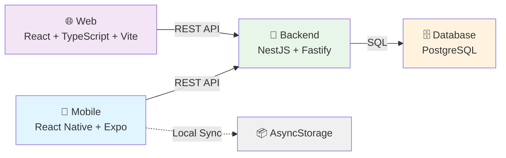

# 🏋️ CargaLog - Complete Application

<div align="center">

[🇧🇷 Português](README.md) | [🇺🇸 English](README_EN.md)

**Complete platform for workout progression tracking: Backend, Web, and Mobile**


</div>

---

## 📋 Table of Contents

- [About the Project](#-about-the-project)
- [Technologies](#-technologies)
- [Projects](#-projects)
- [Getting Started](#-getting-started)
- [Documentation](#-documentation)
- [Progress](#-project-progress)

---

## 📝 About the Project

**CargaLog** is a complete platform for tracking progression in strength training workouts. Developed with modern architecture (Clean Architecture + DDD) and SOLID principles, it offers a perfect experience across backend, web, and mobile platforms.

### Objective
Enable athletes to record, analyze, and track their evolution in real-time across multiple devices with automatic synchronization.

### Key Features
- ✅ **Secure authentication** with JWT and bcrypt
- ✅ **Workout recording** with robust validations
- ✅ **Progression analysis** with interactive charts
- ✅ **Real-time synchronization** between platforms
- ✅ **Responsive interface** on web and mobile
- ✅ **Automated tests** with high coverage (305 tests)
- ✅ **Clean Architecture** and SOLID principles
- ✅ **REST API** documented and production-ready

---

## 🛠️ Technologies

### 📘 Backend
- **NestJS 11** - Progressive Node.js framework
- **FastifyAdapter** - High performance and scalability
- **TypeORM** - ORM with versioned migrations
- **PostgreSQL** - Relational database
- **JWT + Passport** - Secure authentication
- **Winston** - Structured logging
- **Jest** - 305 unit tests (71% coverage)

### 🌐 Frontend Web
- **React 18** - Modern UI Library
- **TypeScript** - Complete static typing
- **Vite** - Ultra-fast build tool
- **Tailwind CSS** - Utility-first CSS
- **Axios** - HTTP client
- **React Router** - SPA routing
- **Recharts** - Interactive charts

### 📱 Mobile
- **React Native** - Cross-platform framework
- **Expo** - Development platform
- **React Navigation** - Native navigation
- **AsyncStorage** - Data persistence
- **Redux** - State management
- **Axios** - Synchronized HTTP client

---

## 📁 Projects

```
CargaLog/
├── 📘 backend/
│   ├── src/
│   │   ├── domain/                 # DDD - Entities, VOs
│   │   ├── application/            # Use cases
│   │   ├── interface-adapters/     # Controllers, Repositories
│   │   ├── frameworks/             # NestJS, TypeORM
│   │   └── shared/                 # Shared services
│   ├── test/                       # E2E tests
│   ├── package.json
│   ├── README.md (Portuguese) ✅
│   └── README_EN.md (English) ✅
│   └── ✅ PRODUCTION READY
│
├── 🌐 frontend/
│   ├── src/
│   │   ├── api/                    # HTTP client
│   │   ├── pages/                  # SPA pages
│   │   ├── components/             # React components
│   │   ├── hooks/                  # Custom hooks
│   │   ├── contexts/               # Context API
│   │   └── styles/                 # Tailwind CSS
│   ├── package.json
│   ├── README.md (Portuguese) ✅
│   └── README_EN.md (English) ✅
│   └── 🔄 In development
│
└── 📱 mobile/
    ├── app/
    │   ├── screens/                # React Native screens
    │   ├── components/             # RN components
    │   ├── navigation/             # React Navigation
    │   ├── api/                    # HTTP client
    │   ├── store/                  # Redux slices
    │   └── hooks/                  # Custom hooks
    ├── package.json
    ├── README.md (Portuguese) ✅
    └── README_EN.md (English) ✅
    └── 🔄 In development
```

---

## 🚀 Getting Started

### Global Prerequisites
- **Node.js 18+** - JavaScript runtime
- **npm or yarn** - Package manager
- **Git** - Version control
- **Supabase Account** (optional - can use local PostgreSQL)

### Quick Installation

#### 1. Clone the repository
```bash
git clone <REPOSITORY_URL>
cd CargaLog
```

#### 2. Backend (Ready to use)
```bash
cd backend
npm install
cp .env.example .env
# Edit .env with your Supabase credentials
npm run migration:run
npm run start:dev
# API available at http://localhost:3000/api/v1
```

#### 3. Frontend Web (Structured base)
```bash
cd ../frontend
npm install
cp .env.example .env
npm run dev
# App available at http://localhost:5173
```

#### 4. Mobile (Structured base)
```bash
cd ../mobile
npm install
cp .env.example .env
expo start
# Scan QR Code with Expo Go
```

---

## 📚 Complete Documentation

### 📘 Backend
- **[Backend README EN-US](backend/README_EN.md)** - Complete documentation in English
- **[Backend README PT-BR](backend/README.md)** - Complete documentation in Portuguese

### 🌐 Frontend Web
- **[Web README EN-US](frontend/README_EN.md)** - Documentation in English
- **[Web README PT-BR](frontend/README.md)** - Documentation in Portuguese

### 📱 Mobile
- **[Mobile README EN-US](mobile/README_EN.md)** - Documentation in English
- **[Mobile README PT-BR](mobile/README.md)** - Documentation in Portuguese

---

## 📊 Architecture



---

## 🧪 Tests

### Test Coverage
| Project | Tests | Coverage | Status |
|---------|-------|----------|--------|
| Backend | 305 | 71% | ✅ Complete |
| Frontend Web | 0 | 0% | 🔄 Planned |
| Mobile | 0 | 0% | 🔄 Planned |

### Run Backend Tests
```bash
cd backend

# Unit tests (no database)
npm run test:unit

# With coverage
npm run test:cov

# E2E (with database)
npm run test:e2e

# Watch mode
npm run test:watch
```

---

## 🌐 Deploy

### 📘 Deploy Backend
```bash
cd backend
npm run build
npm run start:prod
# or with Docker
docker-compose up -d
```

### 🌐 Deploy Web
```bash
cd frontend
npm run build
# Deploy dist folder to:
# - Netlify (recommended)
# - Vercel
# - GitHub Pages
```

### 📱 Deploy Mobile
```bash
cd mobile
# iOS App Store
eas build --platform ios
eas submit --platform ios

# Google Play
eas build --platform android
eas submit --platform android

# Both
eas build --platform all
eas submit --platform all
```

---

## 📈 Project Progress

| Component | Status | Progress | Details |
|-----------|--------|----------|---------|
| **Backend API** | ✅ Complete | 100% | 305 tests, Clean Arch, SOLID |
| **Backend Tests** | ✅ Complete | 100% | 71% coverage, 8 sec execution |
| **Backend Docs** | ✅ Complete | 100% | README EN + PT, 5 guides |
| **Frontend Web** | 🔄 Base | 0% | Structure ready for dev |
| **Mobile App** | 🔄 Base | 0% | Structure ready for dev |
| **Documentation** | ✅ Complete | 100% | All projects documented |

---

## 🎯 Current Status

### ✅ Ready to Use
- [x] Backend REST API 100% functional
- [x] Secure JWT authentication
- [x] Database configured
- [x] 305 tests passing
- [x] Complete documentation
- [x] Docker support

### 🔄 In Development
- [ ] Frontend Web (React)
- [ ] Mobile App (React Native)
- [ ] Frontend tests
- [ ] Mobile tests

### 📅 Next Steps
1. ✅ Implement Frontend Web
2. ✅ Implement Mobile App
3. ⏳ Complete testing
4. ⏳ Production deployment
5. ⏳ Monitoring and observability

---

## 🤝 Contributing

1. **Fork** the project
2. **Create** a branch (`git checkout -b feature/AmazingFeature`)
3. **Commit** your changes (`git commit -m 'Add some AmazingFeature'`)
4. **Push** to the branch (`git push origin feature/AmazingFeature`)
5. **Open** a Pull Request

### Contributing Standards
- Follow **Clean Code** principles
- Add **tests** for new features
- Maintain consistency with **eslint** and **prettier**
- Describe changes in **clear commits**
- Use **conventional commits**

---

## 📄 License

This project is licensed under the **MIT License** - see the [LICENSE](LICENSE) file for details.

```
MIT License

Copyright (c) 2026 CargaLog Contributors

Permission is hereby granted, free of charge, to any person obtaining a copy
of this software and associated documentation files (the "Software"), to deal
in the Software without restriction...
```

---

## 👥 Authors

- **GitHub Copilot** - Architecture, Backend, Documentation, and Setup
- **Developers** - Frontend and Mobile (in development)

---

## 📞 Support and Contact

For support, feedback, or questions:

1. **Open an Issue** on [GitHub Issues](../../issues)
2. **Consult documentation** specific to each project
3. **Review individual READMEs** in each folder
4. **Read setup guides** before reporting issues

---

## 🔗 Quick Links

### Official Documentation
- [Backend (EN-US)](backend/README_EN.md) | [Backend (PT-BR)](backend/README.md)
- [Frontend (EN-US)](frontend/README_EN.md) | [Frontend (PT-BR)](frontend/README.md)
- [Mobile (EN-US)](mobile/README_EN.md) | [Mobile (PT-BR)](mobile/README.md)

### Backend Quick Guides
- [Quick Start](backend/QUICK_TEST.md)
- [Testing Guide](backend/TESTING_GUIDE.md)
- [Complete Analysis](backend/FINAL_ANALYSIS.md)

### Configuration
- [Backend .env](backend/.env.example)
- [Frontend .env](frontend/.env.example)
- [Mobile .env](mobile/.env.example)

### Additional Resources
- [Docker Compose](backend/docker-compose.yml)
- [TypeScript Config](backend/tsconfig.json)
- [ESLint Config](backend/eslint.config.mjs)

---

<div align="center">

### 🎯 Project Overview

```
CargaLog: Fullstack Application for Workout Tracking
├── Backend: ✅ READY (305 tests, Clean Arch, SOLID)
├── Frontend Web: 🔄 Base structure ready
├── Mobile: 🔄 Base structure ready
└── Documentation: ✅ COMPLETE (EN + PT)
```

---

**[⬆ Back to top](#-cargalog---complete-application)**

---

Developed with ❤️ following **Clean Code**, **SOLID Principles**, and **DDD**

Last update: **05/03/2026**

</div>

