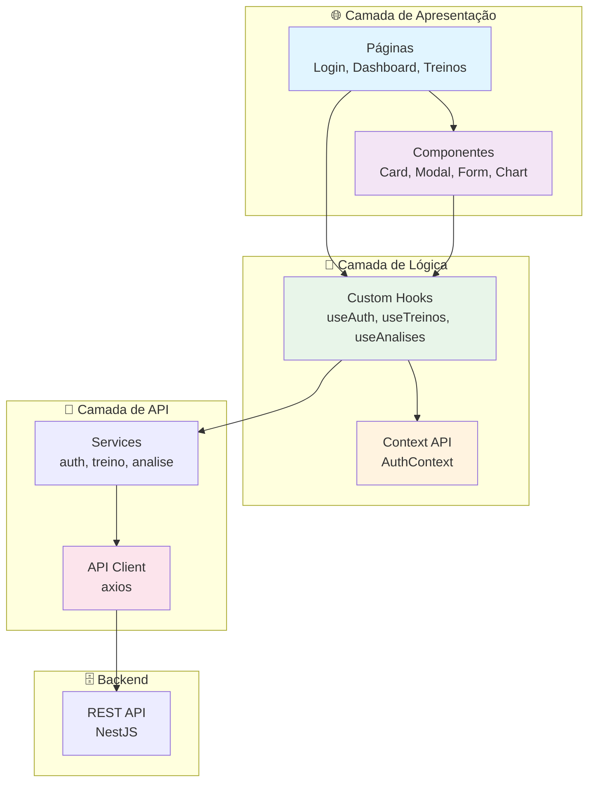

# 🌐 CargaLog - Web Frontend

<div align="center">

[🇧🇷 Português](README.md) | [🇺🇸 English](README_EN.md)

**Dashboard web responsivo para rastreamento de progressão de treinos**


</div>

---

## 📝 Sobre o Projeto

O **CargaLog Web** é um dashboard responsivo desenvolvido com **React 18** e **TypeScript**. Oferece uma interface intuitiva para que os usuários visualizem, gerenciem e analisem sua progressão de treinos de forma eficiente.

### Objetivo Principal
Fornecer uma experiência web moderna e responsiva para:
- ✅ Gerenciar treinos pessoais
- ✅ Visualizar progressão em gráficos
- ✅ Acompanhar estatísticas em tempo real
- ✅ Comparar exercícios
- ✅ Monitorar evolução de carga

---

## 🎯 Funcionalidades Principais

### 🔐 Autenticação
- Login com email e senha
- Registro de nova conta
- Recuperação de senha
- Sessão persistente com localStorage

### 🏋️ Gerenciamento de Treinos
- Criar novo treino
- Editar treino existente
- Deletar treino
- Listar treinos com filtros
- Filtros por exercício, data, etc.

### 📊 Dashboard e Análises
- Estatísticas gerais do usuário
- Gráficos de progressão de carga
- Comparação entre exercícios
- Recordes pessoais
- Evolução ao longo do tempo

### 🎨 Interface
- Design responsivo (mobile, tablet, desktop)
- Tema claro/escuro (opcional)
- Navegação intuitiva
- Feedback visual em ações
- Loading states

---

## 📸 Exemplo Visual do Projeto

<div align="center">
  
  
  
</div>

---

## ✔️ Técnicas e Tecnologias Utilizadas

### 🏗️ Frontend Stack
- **React 18** - Biblioteca de UI
- **TypeScript** - Tipagem estática
- **Vite** - Build tool rápido
- **React Router** - Roteamento
- **Axios** - HTTP client

### 🎨 UI/UX
- **Tailwind CSS** - Utility-first CSS
- **Radix UI** (opcional) - Componentes acessíveis
- **Recharts** - Gráficos
- **React Hook Form** - Gerenciamento de formulários

### 🔐 Segurança
- **JWT Storage** - Armazenamento seguro de tokens
- **CORS** - Proteção cross-origin
- **HTTPS** - Em produção

### ⚡ Performance
- **Code Splitting** - Lazy loading de rotas
- **Image Optimization** - Compressão de imagens
- **Caching** - Cache inteligente
- **Bundle Analysis** - Análise de bundle

### ✅ Testing & Quality
- **Vitest** - Testing framework
- **Testing Library** - Testes de componentes
- **ESLint** - Linting
- **Prettier** - Formatação

---

## 📊 Diagrama de Arquitetura



---

## 📁 Estrutura do Projeto

```
frontend/
├── public/
│   ├── favicon.ico
│   └── index.html
│
├── src/
│   ├── api/
│   │   ├── client.ts              # Axios client configurado
│   │   ├── auth.api.ts            # Endpoints de autenticação
│   │   ├── treino.api.ts          # Endpoints de treino
│   │   └── analise.api.ts         # Endpoints de análise
│   │
│   ├── contexts/
│   │   └── AuthContext.tsx         # Contexto de autenticação
│   │
│   ├── hooks/
│   │   ├── useAuth.ts             # Hook de autenticação
│   │   ├── useTreinos.ts          # Hook de treinos
│   │   └── useAnalises.ts         # Hook de análises
│   │
│   ├── pages/
│   │   ├── Login.tsx              # Página de login
│   │   ├── Register.tsx           # Página de registro
│   │   ├── Dashboard.tsx          # Dashboard principal
│   │   ├── Treinos.tsx            # Listagem de treinos
│   │   ├── TreinoCreate.tsx        # Criar treino
│   │   ├── TreinoEdit.tsx          # Editar treino
│   │   ├── Analises.tsx           # Análises e relatórios
│   │   └── NotFound.tsx           # Página 404
│   │
│   ├── components/
│   │   ├── common/
│   │   │   ├── Header.tsx         # Header/Navbar
│   │   │   ├── Footer.tsx         # Footer
│   │   │   ├── Sidebar.tsx        # Sidebar
│   │   │   └── LoadingSpinner.tsx # Spinner
│   │   │
│   │   ├── layout/
│   │   │   ├── MainLayout.tsx     # Layout principal
│   │   │   └── AuthLayout.tsx     # Layout de autenticação
│   │   │
│   │   ├── forms/
│   │   │   ├── LoginForm.tsx      # Formulário de login
│   │   │   ├── RegisterForm.tsx   # Formulário de registro
│   │   │   └── TreinoForm.tsx     # Formulário de treino
│   │   │
│   │   └── cards/
│   │       ├── TreinoCard.tsx     # Card de treino
│   │       ├── StatCard.tsx       # Card de estatística
│   │       └── RecordCard.tsx     # Card de recorde
│   │
│   ├── styles/
│   │   ├── tailwind.css           # Configuração Tailwind
│   │   └── globals.css            # Estilos globais
│   │
│   ├── utils/
│   │   ├── formatters.ts          # Funções de formatação
│   │   ├── validators.ts          # Validadores
│   │   └── constants.ts           # Constantes
│   │
│   ├── App.tsx                    # Componente principal
│   ├── main.tsx                   # Entrada da aplicação
│   └── vite-env.d.ts              # Tipos Vite
│
├── .env                           # Variáveis de ambiente
├── .env.example                   # Exemplo de .env
├── package.json                   # Dependências
├── tsconfig.json                  # Config TypeScript
├── vite.config.ts                 # Config Vite
└── tailwind.config.js             # Config Tailwind
```

---

## 🛠️ Como Abrir e Rodar o Projeto

### 📋 Pré-requisitos

1. **Node.js 18+**
   ```bash
   node -v
   ```

2. **npm ou yarn**
   ```bash
   npm -v
   ```

3. **Backend rodando**
   - O backend deve estar disponível em `http://localhost:3000`

### 🚀 Instalação e Setup

1. **Clone o repositório:**
   ```bash
   git clone <URL_DO_REPOSITORIO>
   cd CargaLog/frontend
   ```

2. **Instale as dependências:**
   ```bash
   npm install
   ```

3. **Configure o `.env`:**
   ```bash
   cp .env.example .env
   ```

   ```dotenv
   VITE_API_URL=http://localhost:3000/api/v1
   ```

4. **Inicie o servidor de desenvolvimento:**
   ```bash
   npm run dev
   ```

   **Esperado:**
   ```
   ➜  Local:   http://127.0.0.1:5173/
   ```

---

## 📚 Scripts Disponíveis

```bash
# Desenvolvimento
npm run dev          # Inicia servidor de desenvolvimento
npm run dev:host     # Expõe para a rede local

# Build e Produção
npm run build        # Build para produção
npm run preview      # Preview do build

# Testes
npm run test         # Rodar testes
npm run test:ui      # Testes com UI
npm run test:cov     # Com cobertura

# Qualidade
npm run lint         # ESLint
npm run format       # Prettier
npm run type-check   # Verificar tipos TypeScript
```

---

## 🔧 Configuração do `.env`

```dotenv
# API
VITE_API_URL=http://localhost:3000/api/v1

# Ambiente
VITE_ENV=development
```

---

## 🌐 Deploy

### Netlify

```bash
# 1. Install Netlify CLI
npm install -g netlify-cli

# 2. Build
npm run build

# 3. Deploy
netlify deploy --prod --dir=dist
```

### Vercel

```bash
# 1. Install Vercel CLI
npm install -g vercel

# 2. Deploy
vercel --prod
```

### GitHub Pages

```bash
# 1. Configure vite.config.ts
export default defineConfig({
  base: '/CargaLog/'
})

# 2. Build
npm run build

# 3. Deploy (via GitHub Actions)
```

---

## 📊 Métricas

| Métrica | Status |
|---------|--------|
| Performance (Lighthouse) | 90+ |
| Responsividade | ✅ |
| Acessibilidade | 95+ |
| Type Coverage | 100% |
| Bundle Size | < 300KB |

---

## 🤝 Contribuindo

1. Faça um Fork
2. Crie uma branch (`git checkout -b feature/AmazingFeature`)
3. Commit suas mudanças
4. Push para a branch
5. Abra um Pull Request

---

## 📄 Licença

MIT License - veja o arquivo LICENSE para detalhes.

---

<div align="center">

**[⬆ Voltar ao topo](#-cargalog---web-frontend)**

Feito com ❤️ por desenvolvedores apaixonados por clean code

</div>

