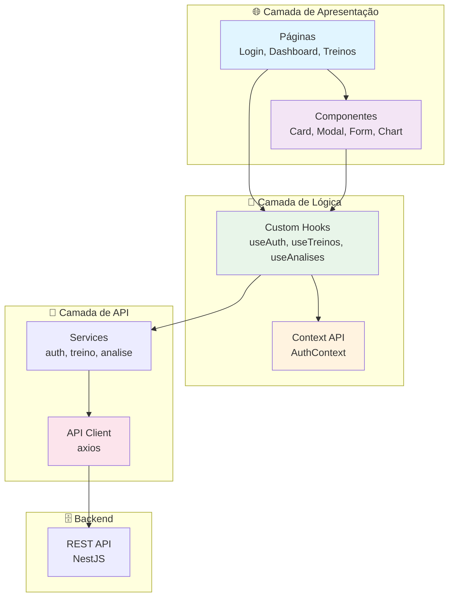

# 🌐 CargaLog - Web Frontend

<div align="center">

[🇧🇷 Português](README.md) | [🇺🇸 English](README_EN.md)

**Dashboard web responsivo para rastreamento de progressão de treinos**


</div>

---

## 📝 Sobre o Projeto

O **CargaLog Web** é um dashboard responsivo desenvolvido com **React 19** e **TypeScript**. Oferece uma interface intuitiva para que os usuários visualizem, gerenciem e analisem sua progressão de treinos de forma eficiente.

## ✅ Status Atualizado (2026-03-20)

- Runtime UI: `react@19.2.0` e `react-dom@19.2.0`
- Build: `vite@8.0.0-beta.13`
- Estilização: `tailwindcss@4.2.1` + `@tailwindcss/postcss@4.2.1`
- Testes: `vitest@4.1.0` com `@testing-library/react` (6 arquivos, 31 testes)
- Scripts: `dev`, `build`, `lint`, `lint:check`, `format`, `test`, `test:watch`
- APIs: `auth.api.ts`, `treino.api.ts`, `analise.api.ts`
- CI: `.github/workflows/frontend-ci.yml` (lint + format check)

---

## 🎯 Funcionalidades Principais

### 🔐 Autenticação
- Login com email e senha
- Registro de nova conta
- Recuperação de senha
- Sessão persistente com localStorage

### 🏋️ Gerenciamento de Treinos
- Criar novo treino
- Editar treino existente
- Deletar treino
- Listar treinos com filtros
- Filtros por exercício, data, etc.

### 📊 Dashboard e Análises
- Estatísticas gerais do usuário
- Gráficos de progressão de carga
- Comparação entre exercícios
- Recordes pessoais
- Evolução ao longo do tempo

### 🎨 Interface
- Design responsivo (mobile, tablet, desktop)
- Tema claro/escuro (opcional)
- Navegação intuitiva
- Feedback visual em ações
- Loading states

---

## 📸 Exemplo Visual do Projeto

<div align="center">
  
  
  
</div>

---

## ✔️ Técnicas e Tecnologias Utilizadas

### 🏗️ Frontend Stack
- **React 19** - Biblioteca de UI
- **TypeScript** - Tipagem estática
- **Vite 8** - Build tool rápido
- **React Router** - Roteamento
- **Tailwind CSS 4** - Estilização utility-first
- **Axios** - Cliente HTTP

### 🎨 UI/UX
- **Tailwind CSS** - Utility-first CSS
- **Radix UI** (opcional) - Componentes acessíveis
- **Recharts** - Gráficos
- **React Hook Form** - Gerenciamento de formulários

### 🔐 Segurança
- **JWT Storage** - Armazenamento seguro de tokens
- **CORS** - Proteção cross-origin
- **HTTPS** - Em produção

### ⚡ Performance
- **Code Splitting** - Lazy loading de rotas
- **Image Optimization** - Compressão de imagens
- **Caching** - Cache inteligente
- **Bundle Analysis** - Análise de bundle

### ✅ Testing & Quality
- **Vitest** - Testing framework
- **Testing Library** - Testes de componentes
- **ESLint** - Linting
- **Prettier** - Formatação

---

## 📊 Diagrama de Arquitetura



---

## 📁 Estrutura do Projeto

```
frontend/
├── public/
│   ├── favicon.svg
│   └── vite.svg
├── src/
│   ├── api/
│   │   ├── analise.api.ts
│   │   ├── auth.api.ts
│   │   ├── client.ts
│   │   └── treino.api.ts
│   ├── components/
│   │   ├── cards/
│   │   ├── charts/
│   │   └── common/
│   ├── contexts/
│   │   ├── AuthContext.tsx
│   │   └── AuthContextType.ts
│   ├── hooks/
│   │   └── useAuth.ts
│   ├── pages/
│   │   ├── Analises.tsx
│   │   ├── Dashboard.tsx
│   │   ├── EsqueciSenha.tsx
│   │   ├── Login.tsx
│   │   ├── Perfil.tsx
│   │   ├── Register.tsx
│   │   ├── ResetSenha.tsx
│   │   └── Treinos/
│   ├── utils/
│   │   └── formatters.ts
│   ├── test/
│   │   └── setup.ts
│   ├── App.tsx
│   ├── App.css
│   ├── index.css
│   └── main.tsx
├── index.html
├── package.json
├── vite.config.ts
├── tailwind.config.js
└── tsconfig.json
```

---

## 🛠️ Como Abrir e Rodar o Projeto

### 📋 Pré-requisitos

1. **Node.js 18+**
   ```bash
   node -v
   ```

2. **npm ou yarn**
   ```bash
   npm -v
   ```

3. **Backend rodando**
   - O backend deve estar disponível em `http://localhost:3000`

### 🚀 Instalação e Setup

1. **Clone o repositório:**
   ```bash
   git clone <URL_DO_REPOSITORIO>
   cd CargaLog/frontend
   ```

2. **Instale as dependências:**
   ```bash
   npm install
   ```

3. **Configure o `.env`:**
   ```bash
   cp .env.example .env
   ```

   ```dotenv
   VITE_API_URL=http://localhost:3000/api/v1
   ```

4. **Inicie o servidor de desenvolvimento:**
   ```bash
   npm run dev
   ```

   **Esperado:**
   ```
   ➜  Local:   http://127.0.0.1:5173/
   ```

---

## 📚 Scripts Disponíveis

```bash
npm run dev        # Inicia Vite em desenvolvimento
npm run build      # Build de produção (tsc + vite build)
npm run preview    # Preview do build
npm run lint       # ESLint com --fix
npm run lint:check # ESLint (verificação)
npm run format     # Prettier (formatação)
npm run test       # Vitest (testes unitários)
npm run test:watch # Vitest em watch mode
```

---

## 🔧 Configuração do `.env`

```dotenv
# API
VITE_API_URL=http://localhost:3000/api/v1

# Ambiente
VITE_ENV=development
```

---

## 🌐 Deploy

### Netlify

```bash
# 1. Install Netlify CLI
npm install -g netlify-cli

# 2. Build
npm run build

# 3. Deploy
netlify deploy --prod --dir=dist
```

### Vercel

```bash
# 1. Install Vercel CLI
npm install -g vercel

# 2. Deploy
vercel --prod
```

### GitHub Pages

```bash
# 1. Configure vite.config.ts
export default defineConfig({
  base: '/CargaLog/'
})

# 2. Build
npm run build

# 3. Deploy (via GitHub Actions)
```

---

## 📊 Métricas

| Métrica | Status |
|---------|--------|
| Testes Unitários | 31 (6 arquivos) |
| Framework de Teste | Vitest |
| Testing Library | ✅ |
| ESLint + Prettier | ✅ |
| Performance (Lighthouse) | 90+ |
| Responsividade | ✅ |
| Acessibilidade | 95+ |
| Type Coverage | 100% |
| Bundle Size | < 300KB |

---

## 🤝 Contribuindo

1. Faça um Fork
2. Crie uma branch (`git checkout -b feature/AmazingFeature`)
3. Commit suas mudanças
4. Push para a branch
5. Abra um Pull Request

---

## 📄 Licença

MIT License - veja o arquivo LICENSE para detalhes.

---

<div align="center">

**[⬆ Voltar ao topo](#-cargalog---web-frontend)**

Feito com ❤️ por desenvolvedores apaixonados por clean code

</div>

