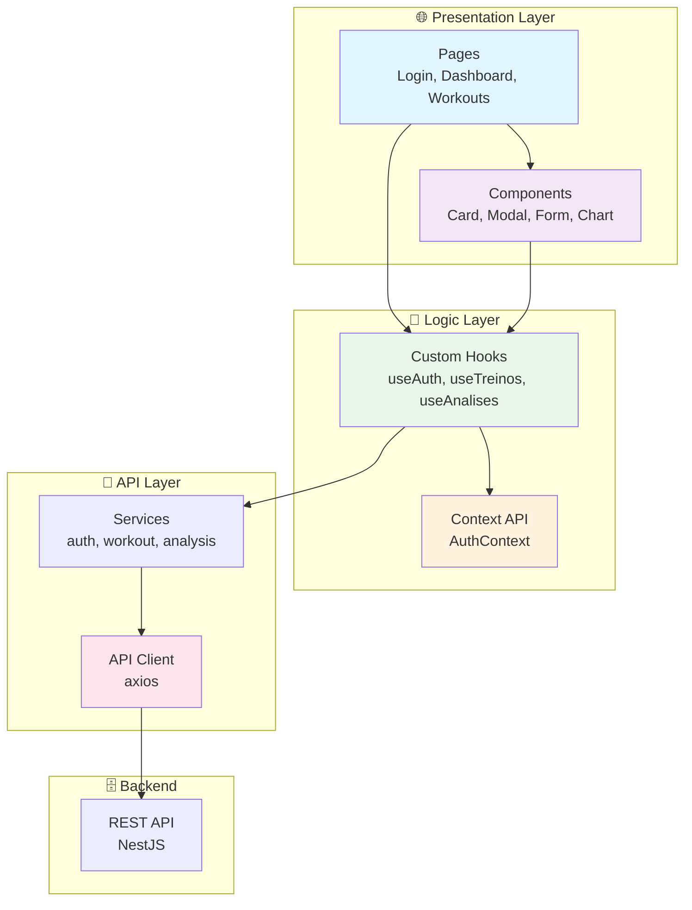

# 🌐 CargaLog - Web Frontend

<div align="center">

[🇧🇷 Português](README.md) | [🇺🇸 English](README_EN.md)

**Responsive web dashboard for workout progress tracking**


</div>

---

## 📝 About the Project

The **CargaLog Web** is a responsive dashboard developed with **React 18** and **TypeScript**. It provides an intuitive interface for users to view, manage, and analyze their workout progression efficiently.

### Main Objective
Provide a modern and responsive web experience for:
- ✅ Manage personal workouts
- ✅ View progression in charts
- ✅ Track real-time statistics
- ✅ Compare exercises
- ✅ Monitor load evolution

---

## 🎯 Main Features

### 🔐 Authentication
- Login with email and password
- New account registration
- Password recovery
- Persistent session with localStorage

### 🏋️ Workout Management
- Create new workout
- Edit existing workout
- Delete workout
- List workouts with filters
- Filters by exercise, date, etc.

### 📊 Dashboard and Analysis
- User general statistics
- Load progression charts
- Exercise comparison
- Personal records
- Evolution over time

### 🎨 Interface
- Responsive design (mobile, tablet, desktop)
- Light/dark theme (optional)
- Intuitive navigation
- Visual feedback on actions
- Loading states

---

## 📸 Project Visual Example

<div align="center">
  
  
  
</div>

---

## ✔️ Techniques and Technologies Used

### 🏗️ Frontend Stack
- **React 18** - UI library
- **TypeScript** - Static typing
- **Vite** - Fast build tool
- **React Router** - Routing
- **Axios** - HTTP client

### 🎨 UI/UX
- **Tailwind CSS** - Utility-first CSS
- **Radix UI** (optional) - Accessible components
- **Recharts** - Charts
- **React Hook Form** - Form management

### 🔐 Security
- **JWT Storage** - Secure token storage
- **CORS** - Cross-origin protection
- **HTTPS** - In production

### ⚡ Performance
- **Code Splitting** - Lazy loading routes
- **Image Optimization** - Image compression
- **Caching** - Smart caching
- **Bundle Analysis** - Bundle analysis

### ✅ Testing & Quality
- **Vitest** - Testing framework
- **Testing Library** - Component testing
- **ESLint** - Linting
- **Prettier** - Formatting

---

## 📊 Architecture Diagram



---

## 📁 Project Structure

```
frontend/
├── public/
│   ├── favicon.ico
│   └── index.html
│
├── src/
│   ├── api/
│   │   ├── client.ts              # Configured axios client
│   │   ├── auth.api.ts            # Authentication endpoints
│   │   ├── treino.api.ts          # Workout endpoints
│   │   └── analise.api.ts         # Analysis endpoints
│   │
│   ├── contexts/
│   │   └── AuthContext.tsx         # Authentication context
│   │
│   ├── hooks/
│   │   ├── useAuth.ts             # Authentication hook
│   │   ├── useTreinos.ts          # Workouts hook
│   │   └── useAnalises.ts         # Analysis hook
│   │
│   ├── pages/
│   │   ├── Login.tsx              # Login page
│   │   ├── Register.tsx           # Registration page
│   │   ├── Dashboard.tsx          # Main dashboard
│   │   ├── Treinos.tsx            # Workouts list
│   │   ├── TreinoCreate.tsx        # Create workout
│   │   ├── TreinoEdit.tsx          # Edit workout
│   │   ├── Analises.tsx           # Analysis and reports
│   │   └── NotFound.tsx           # 404 page
│   │
│   ├── components/
│   │   ├── common/
│   │   │   ├── Header.tsx         # Header/Navbar
│   │   │   ├── Footer.tsx         # Footer
│   │   │   ├── Sidebar.tsx        # Sidebar
│   │   │   └── LoadingSpinner.tsx # Spinner
│   │   │
│   │   ├── layout/
│   │   │   ├── MainLayout.tsx     # Main layout
│   │   │   └── AuthLayout.tsx     # Auth layout
│   │   │
│   │   ├── forms/
│   │   │   ├── LoginForm.tsx      # Login form
│   │   │   ├── RegisterForm.tsx   # Registration form
│   │   │   └── TreinoForm.tsx     # Workout form
│   │   │
│   │   └── cards/
│   │       ├── TreinoCard.tsx     # Workout card
│   │       ├── StatCard.tsx       # Statistic card
│   │       └── RecordCard.tsx     # Record card
│   │
│   ├── styles/
│   │   ├── tailwind.css           # Tailwind configuration
│   │   └── globals.css            # Global styles
│   │
│   ├── utils/
│   │   ├── formatters.ts          # Formatting functions
│   │   ├── validators.ts          # Validators
│   │   └── constants.ts           # Constants
│   │
│   ├── App.tsx                    # Main component
│   ├── main.tsx                   # Application entry
│   └── vite-env.d.ts              # Vite types
│
├── .env                           # Environment variables
├── .env.example                   # .env example
├── package.json                   # Dependencies
├── tsconfig.json                  # TypeScript config
├── vite.config.ts                 # Vite config
└── tailwind.config.js             # Tailwind config
```

---

## 🛠️ How to Open and Run the Project

### 📋 Prerequisites

1. **Node.js 18+**
   ```bash
   node -v
   ```

2. **npm or yarn**
   ```bash
   npm -v
   ```

3. **Backend running**
   - Backend must be available at `http://localhost:3000`

### 🚀 Installation and Setup

1. **Clone the repository:**
   ```bash
   git clone <REPOSITORY_URL>
   cd CargaLog/frontend
   ```

2. **Install dependencies:**
   ```bash
   npm install
   ```

3. **Configure `.env`:**
   ```bash
   cp .env.example .env
   ```

   ```dotenv
   VITE_API_URL=http://localhost:3000/api/v1
   ```

4. **Start the development server:**
   ```bash
   npm run dev
   ```

   **Expected output:**
   ```
   ➜  Local:   http://127.0.0.1:5173/
   ```

---

## 📚 Available Scripts

```bash
# Development
npm run dev          # Start development server
npm run dev:host     # Expose to local network

# Build and Production
npm run build        # Build for production
npm run preview      # Preview the build

# Tests
npm run test         # Run tests
npm run test:ui      # Tests with UI
npm run test:cov     # With coverage

# Quality
npm run lint         # ESLint
npm run format       # Prettier
npm run type-check   # Check TypeScript types
```

---

## 🔧 `.env` Configuration

```dotenv
# API
VITE_API_URL=http://localhost:3000/api/v1

# Environment
VITE_ENV=development
```

---

## 🌐 Deploy

### Netlify

```bash
# 1. Install Netlify CLI
npm install -g netlify-cli

# 2. Build
npm run build

# 3. Deploy
netlify deploy --prod --dir=dist
```

### Vercel

```bash
# 1. Install Vercel CLI
npm install -g vercel

# 2. Deploy
vercel --prod
```

### GitHub Pages

```bash
# 1. Configure vite.config.ts
export default defineConfig({
  base: '/CargaLog/'
})

# 2. Build
npm run build

# 3. Deploy (via GitHub Actions)
```

---

## 📊 Metrics

| Metric | Status |
|--------|--------|
| Performance (Lighthouse) | 90+ |
| Responsiveness | ✅ |
| Accessibility | 95+ |
| Type Coverage | 100% |
| Bundle Size | < 300KB |

---

## 🤝 Contributing

1. Fork the project
2. Create a branch (`git checkout -b feature/AmazingFeature`)
3. Commit your changes
4. Push to the branch
5. Open a Pull Request

---

## 📄 License

MIT License - see the LICENSE file for details.

---

<div align="center">

**[⬆ Back to top](#-cargalog---web-frontend)**

Made with ❤️ by developers passionate about clean code

</div>

