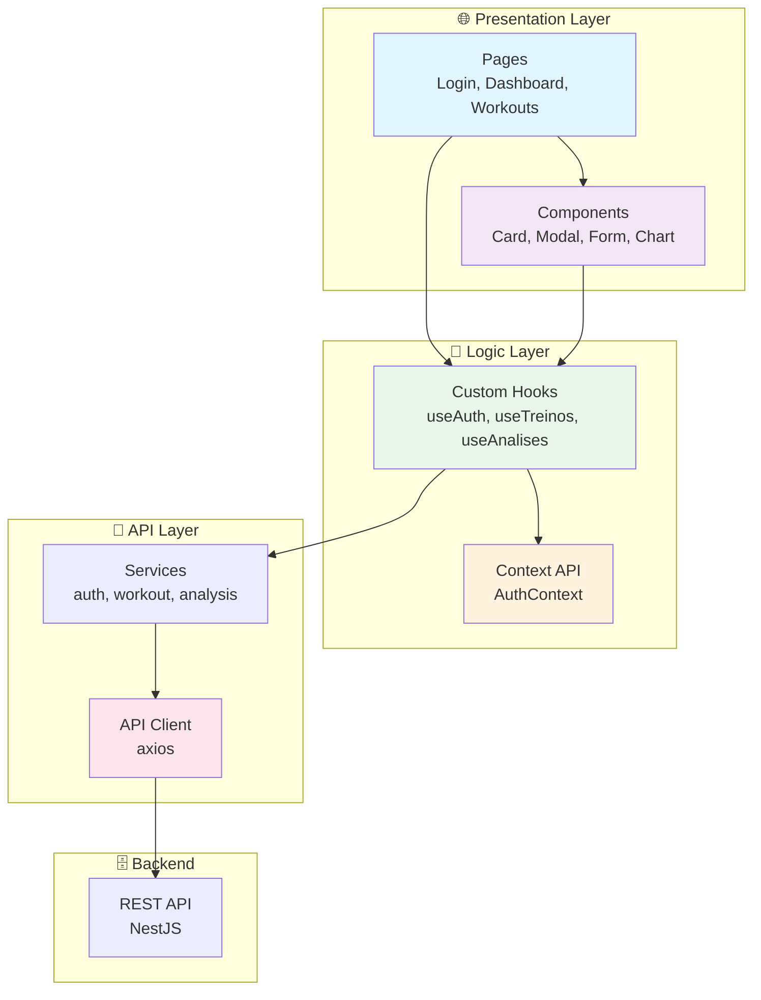

# 🌐 CargaLog - Web Frontend

<div align="center">

[🇧🇷 Português](README.md) | [🇺🇸 English](README_EN.md)

**Responsive web dashboard for workout progress tracking**


</div>

---

## 📝 About the Project

The **CargaLog Web** is a responsive dashboard built with **React 19** and **TypeScript**.

## ✅ Updated Status (2026-03-06)

- UI runtime: `react@19.2.0` and `react-dom@19.2.0`
- Build tool: `vite@8.0.0-beta.13`
- Styling: `tailwindcss@4.2.1` + `@tailwindcss/postcss@4.2.1`
- Real scripts: `npm run dev`, `npm run build`, `npm run preview`, `npm run lint`
- API clients: `auth.api.ts`, `treino.api.ts`, `analise.api.ts`

---

## 🎯 Main Features

### 🔐 Authentication
- Login with email and password
- New account registration
- Password recovery
- Persistent session with localStorage

### 🏋️ Workout Management
- Create new workout
- Edit existing workout
- Delete workout
- List workouts with filters
- Filters by exercise, date, etc.

### 📊 Dashboard and Analysis
- User general statistics
- Load progression charts
- Exercise comparison
- Personal records
- Evolution over time

### 🎨 Interface
- Responsive design (mobile, tablet, desktop)
- Light/dark theme (optional)
- Intuitive navigation
- Visual feedback on actions
- Loading states

---

## 📸 Project Visual Example

<div align="center">
  
  
  
</div>

---

## ✔️ Techniques and Technologies Used

### 🏗️ Frontend Stack
- **React 19** - UI library
- **TypeScript** - Static typing
- **Vite 8** - Build tool
- **React Router** - Routing
- **Tailwind CSS 4** - Utility-first styling
- **Axios** - HTTP client

### 🎨 UI/UX
- **Tailwind CSS** - Utility-first CSS
- **Radix UI** (optional) - Accessible components
- **Recharts** - Charts
- **React Hook Form** - Form management

### 🔐 Security
- **JWT Storage** - Secure token storage
- **CORS** - Cross-origin protection
- **HTTPS** - In production

### ⚡ Performance
- **Code Splitting** - Lazy loading routes
- **Image Optimization** - Image compression
- **Caching** - Smart caching
- **Bundle Analysis** - Bundle analysis

### ✅ Testing & Quality
- **Vitest** - Testing framework
- **Testing Library** - Component testing
- **ESLint** - Linting
- **Prettier** - Formatting

---

## 📊 Architecture Diagram



---

## 📁 Project Structure

```
frontend/
├── public/
│   ├── favicon.svg
│   └── vite.svg
├── src/
│   ├── api/
│   │   ├── analise.api.ts
│   │   ├── auth.api.ts
│   │   ├── client.ts
│   │   └── treino.api.ts
│   ├── components/
│   │   ├── cards/
│   │   ├── charts/
│   │   └── common/
│   ├── contexts/
│   │   ├── AuthContext.tsx
│   │   └── AuthContextType.ts
│   ├── hooks/
│   │   └── useAuth.ts
│   ├── pages/
│   │   ├── Analises.tsx
│   │   ├── Dashboard.tsx
│   │   ├── EsqueciSenha.tsx
│   │   ├── Login.tsx
│   │   ├── Perfil.tsx
│   │   ├── Register.tsx
│   │   ├── ResetSenha.tsx
│   │   └── Treinos/
│   ├── utils/
│   │   └── formatters.ts
│   ├── App.tsx
│   ├── App.css
│   ├── index.css
│   └── main.tsx
├── index.html
├── package.json
├── vite.config.ts
├── tailwind.config.js
└── tsconfig.json
```

---

## 🛠️ How to Open and Run the Project

### 📋 Prerequisites

1. **Node.js 18+**
   ```bash
   node -v
   ```

2. **npm or yarn**
   ```bash
   npm -v
   ```

3. **Backend running**
   - Backend must be available at `http://localhost:3000`

### 🚀 Installation and Setup

1. **Clone the repository:**
   ```bash
   git clone <REPOSITORY_URL>
   cd CargaLog/frontend
   ```

2. **Install dependencies:**
   ```bash
   npm install
   ```

3. **Configure `.env`:**
   ```bash
   cp .env.example .env
   ```

   ```dotenv
   VITE_API_URL=http://localhost:3000/api/v1
   ```

4. **Start the development server:**
   ```bash
   npm run dev
   ```

   **Expected output:**
   ```
   ➜  Local:   http://127.0.0.1:5173/
   ```

---

## 📚 Available Scripts

```bash
npm run dev      # Start Vite dev server
npm run build    # Production build (tsc + vite build)
npm run preview  # Preview build
npm run lint     # ESLint
```

---

## 🔧 `.env` Configuration

```dotenv
# API
VITE_API_URL=http://localhost:3000/api/v1

# Environment
VITE_ENV=development
```

---

## 🌐 Deploy

### Netlify

```bash
# 1. Install Netlify CLI
npm install -g netlify-cli

# 2. Build
npm run build

# 3. Deploy
netlify deploy --prod --dir=dist
```

### Vercel

```bash
# 1. Install Vercel CLI
npm install -g vercel

# 2. Deploy
vercel --prod
```

### GitHub Pages

```bash
# 1. Configure vite.config.ts
export default defineConfig({
  base: '/CargaLog/'
})

# 2. Build
npm run build

# 3. Deploy (via GitHub Actions)
```

---

## 📊 Metrics

| Metric | Status |
|--------|--------|
| Performance (Lighthouse) | 90+ |
| Responsiveness | ✅ |
| Accessibility | 95+ |
| Type Coverage | 100% |
| Bundle Size | < 300KB |

---

## 🤝 Contributing

1. Fork the project
2. Create a branch (`git checkout -b feature/AmazingFeature`)
3. Commit your changes
4. Push to the branch
5. Open a Pull Request

---

## 📄 License

MIT License - see the LICENSE file for details.

---

<div align="center">

**[⬆ Back to top](#-cargalog---web-frontend)**

Made with ❤️ by developers passionate about clean code

</div>

