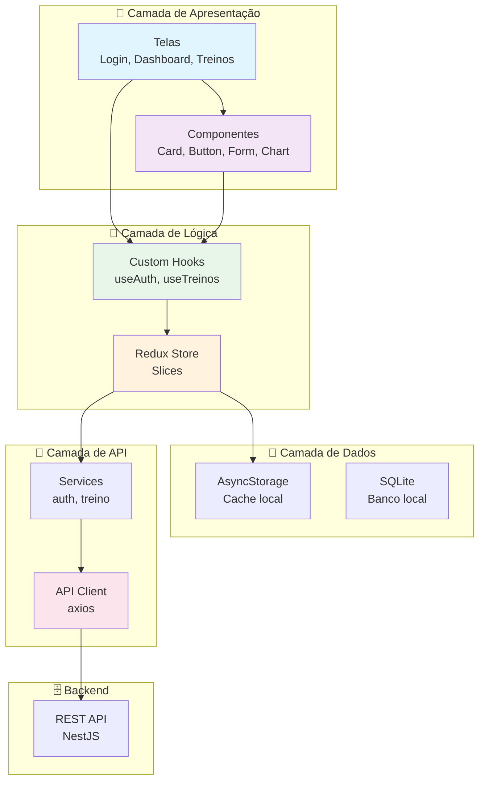

# 📱 CargaLog - Mobile

<div align="center">

[🇧🇷 Português](README.md) | [🇺🇸 English](README_EN.md)

**Aplicativo mobile nativo para iOS e Android - Rastreamento de progressão de treinos**


</div>

---

## 📝 Sobre o Projeto

O **CargaLog Mobile** é um aplicativo nativo para **iOS** e **Android** desenvolvido com **React Native CLI** e **NativeWind**. Permite que os usuários registrem, gerenciem e acompanhem sua progressão de treinos de forma portátil e conveniente.

## ✅ Status Atualizado (2026-03-20)

- Runtime principal: `react-native@0.84.1`
- Estilização: `nativewind@4.2.2` + `tailwindcss@3.4.1`
- Navegação: `@react-navigation/native` + `native-stack` + `bottom-tabs`
- Testes: `jest@29.6.3` com `@testing-library/react-native` (3 arquivos, 19 testes)
- Scripts: `start`, `android`, `ios`, `lint`, `lint:check`, `format`, `test`
- CI: `.github/workflows/mobile-ci.yml` (lint + format check + test)

---

## 🎯 Funcionalidades Principais

### 🔐 Autenticação
- Login com email e senha
- Registro de novo usuário
- Biometria (Face ID, Touch ID)
- Sessão persistente
- Logout seguro

### 🏋️ Registro de Treinos
- Criar treino rápido
- Registro por voz (opcional)
- Timer integrado
- Histórico de treinos
- Edição de treinos anteriores

### 📊 Dashboard Mobile
- Resumo do dia
- Recordes pessoais
- Gráficos de progressão
- Estatísticas rápidas
- Widget de treino do dia

### 🔔 Notificações
- Lembrete de treino
- Notificação de novo recorde
- Semanal resumo de progresso
- Alertas de meta atingida

### ⚙️ Configurações
- Temas (claro/escuro)
- Unidades (kg/lb)
- Idioma
- Sincronização automática
- Backup de dados

---

## 📸 Exemplo Visual do Projeto

<div align="center">
  
  
  
  
</div>

---

## ✔️ Técnicas e Tecnologias Utilizadas

### 📱 Mobile Stack
- **React Native CLI** - Framework mobile
- **NativeWind** - Estilização utility-first
- **TypeScript** - Tipagem estática
- **React Navigation** - Navegação
- **Axios** - HTTP client
- **AsyncStorage** - Armazenamento local

### 🎨 UI/UX
- **React Native Paper** - Componentes Material Design
- **React Native SVG** - Gráficos vetoriais
- **Recharts** - Gráficos avançados
- **React Native Gesture Handler** - Gestos

### 📊 Dados
- **AsyncStorage** - Cache local
- **Redux** (opcional) - State management
- **SQLite** - Banco de dados local

### 🔐 Segurança
- **JWT Storage** - Token seguro
- **Biometria** - Autenticação biométrica
- **Encryption** - Dados criptografados
- **HTTPS** - Comunicação segura

### ✅ Testing & Quality
- **Jest** - Testing framework
- **Detox** - E2E testing
- **ESLint** - Linting

---

## 📊 Diagrama de Arquitetura



---

## 📁 Estrutura do Projeto

```
mobile/
├── src/
│   ├── api/
│   ├── contexts/
│   ├── hooks/
│   ├── navigation/
│   ├── screens/
│   └── utils/
├── android/
├── ios/
├── App.tsx
├── index.js
├── input.css
├── babel.config.js
├── metro.config.js
├── tailwind.config.js
├── package.json
└── tsconfig.json
```

---

## 🛠️ Como Abrir e Rodar o Projeto

### 📋 Pré-requisitos

1. **Node.js 22+**
2. **Android Studio** (SDK + emulator) para Android
3. **Xcode + CocoaPods** (apenas macOS) para iOS
4. **Java 17** para build Android

### 🚀 Instalação e Setup

```bash
cd mobile
npm install
```

### ▶️ Executar em Desenvolvimento

```bash
# Terminal 1
npm run start

# Terminal 2 (Android)
npm run android

# Terminal 2 (iOS - macOS)
npm run ios
```

### 🔁 Limpar cache do Metro (quando necessário)

```bash
npx react-native start --reset-cache
```

---

## 📚 Scripts Disponíveis

```bash
npm run start       # Inicia Metro bundler
npm run android     # Build + run Android
npm run ios         # Build + run iOS (macOS)
npm run lint        # ESLint com --fix
npm run lint:check  # ESLint (verificação)
npm run format      # Prettier (formatação)
npm run test        # Jest (testes unitários)
```

---

## 🔧 Configuração do `.env`

Use variáveis em formato React Native (sem `EXPO_PUBLIC_`), por exemplo:

```dotenv
API_URL=http://localhost:3000/api/v1
ENV=development
```

---

## 🌐 Build de Produção

### Android

```bash
cd android
./gradlew assembleRelease
```

### iOS (macOS)

```bash
cd ios
pod install
xcodebuild -workspace mobile.xcworkspace -scheme mobile -configuration Release
```

---

## 📊 Métricas

| Métrica | Status |
|---------|--------|
| Testes Unitários | 19 (3 arquivos) |
| Framework de Teste | Jest |
| ESLint + Prettier | ✅ |
| Compatibilidade iOS | 14+ |
| Compatibilidade Android | 10+ |
| Tamanho da App | < 50MB |
| Performance | 60 FPS |

---

## 🤝 Contribuindo

1. Faça um Fork
2. Crie uma branch (`git checkout -b feature/AmazingFeature`)
3. Commit suas mudanças
4. Push para a branch
5. Abra um Pull Request

---

## 📄 Licença

MIT License - veja o arquivo LICENSE para detalhes.

---

<div align="center">

**[⬆ Voltar ao topo](#-cargalog---mobile)**

Feito com ❤️ por desenvolvedores apaixonados por clean code

</div>

