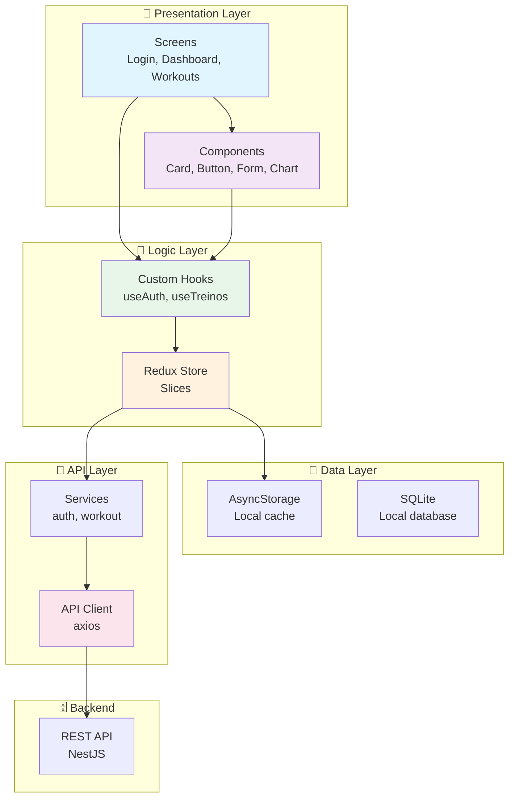

# 📱 CargaLog - Mobile

<div align="center">

[🇧🇷 Português](README.md) | [🇺🇸 English](README_EN.md)

**Native mobile app for iOS and Android - Workout progression tracking**


</div>

---

## 📝 About the Project

The **CargaLog Mobile** is a native app for **iOS** and **Android** built with **React Native CLI** and **NativeWind**.

## ✅ Updated Status (2026-03-20)

- Main runtime: `react-native@0.84.1`
- Styling: `nativewind@4.2.2` + `tailwindcss@3.4.1`
- Navigation: `@react-navigation/native` + `native-stack` + `bottom-tabs`
- Tests: `jest@29.6.3` with `@testing-library/react-native` (3 files, 19 tests)
- Scripts: `start`, `android`, `ios`, `lint`, `lint:check`, `format`, `test`
- CI: `.github/workflows/mobile-ci.yml` (lint + format check + test)

---

## 🎯 Main Features

### 🔐 Authentication
- Login with email and password
- New user registration
- Biometrics (Face ID, Touch ID)
- Persistent session
- Secure logout

### 🏋️ Workout Recording
- Quick workout creation
- Voice recording (optional)
- Integrated timer
- Workout history
- Edit previous workouts

### 📊 Mobile Dashboard
- Daily summary
- Personal records
- Progression charts
- Quick statistics
- Daily workout widget

### 🔔 Notifications
- Workout reminder
- New record notification
- Weekly progress summary
- Goal achieved alerts

### ⚙️ Settings
- Themes (light/dark)
- Units (kg/lb)
- Language
- Auto sync
- Data backup

---

## 📸 Project Visual Example

<div align="center">
  
  
  
  
</div>

---

## ✔️ Techniques and Technologies Used

### 📱 Mobile Stack
- **React Native CLI** - Mobile framework
- **NativeWind** - Utility-first styling
- **TypeScript** - Static typing
- **React Navigation** - Navigation
- **Axios** - HTTP client
- **AsyncStorage** - Local storage

### 🎨 UI/UX
- **React Native Paper** - Material Design components
- **React Native SVG** - Vector graphics
- **Recharts** - Advanced charts
- **React Native Gesture Handler** - Gestures

### 📊 Data
- **AsyncStorage** - Local cache
- **Redux** (optional) - State management
- **SQLite** - Local database

### 🔐 Security
- **JWT Storage** - Secure token storage
- **Biometrics** - Biometric authentication
- **Encryption** - Encrypted data
- **HTTPS** - Secure communication

### ✅ Testing & Quality
- **Jest** - Testing framework
- **Detox** - E2E testing
- **ESLint** - Linting

---

## 📊 Architecture Diagram



---

## 📁 Project Structure

```
mobile/
├── src/
│   ├── api/
│   ├── contexts/
│   ├── hooks/
│   ├── navigation/
│   ├── screens/
│   └── utils/
├── android/
├── ios/
├── App.tsx
├── index.js
├── input.css
├── babel.config.js
├── metro.config.js
├── tailwind.config.js
├── package.json
└── tsconfig.json
```

---

## 🛠️ How to Run

### Prerequisites

1. **Node.js 22+**
2. **Android Studio** (SDK + emulator)
3. **Xcode + CocoaPods** (macOS only)
4. **Java 17**

### Install

```bash
cd mobile
npm install
```

### Start in Development

```bash
# Terminal 1
npm run start

# Terminal 2 (Android)
npm run android

# Terminal 2 (iOS - macOS)
npm run ios
```

### Reset Metro Cache

```bash
npx react-native start --reset-cache
```

---

## 📚 Available Scripts

```bash
npm run start        # Start Metro bundler
npm run android      # Build + run Android
npm run ios          # Build + run iOS (macOS)
npm run lint         # ESLint with --fix
npm run lint:check  # ESLint (check only)
npm run format       # Prettier (format)
npm run test         # Jest (unit tests)
```

---

## 🔧 `.env` Configuration

Use React Native-style variables (without `EXPO_PUBLIC_`), for example:

```dotenv
API_URL=http://localhost:3000/api/v1
ENV=development
```

---

## 🌐 Production Build

### Android

```bash
cd android
./gradlew assembleRelease
```

### iOS (macOS)

```bash
cd ios
pod install
xcodebuild -workspace mobile.xcworkspace -scheme mobile -configuration Release
```

---

## 📊 Metrics

| Metric | Status |
|--------|--------|
| Unit Tests | 19 (3 files) |
| Test Framework | Jest |
| ESLint + Prettier | ✅ |
| iOS Compatibility | 14+ |
| Android Compatibility | 10+ |
| App Size | < 50MB |
| Performance | 60 FPS |

---

## 🤝 Contributing

1. Fork the project
2. Create a branch (`git checkout -b feature/AmazingFeature`)
3. Commit your changes
4. Push to the branch
5. Open a Pull Request

---

## 📄 License

MIT License - see the LICENSE file for details.

---

<div align="center">

**[⬆ Back to top](#-cargalog---mobile)**

Made with ❤️ by developers passionate about clean code

</div>

