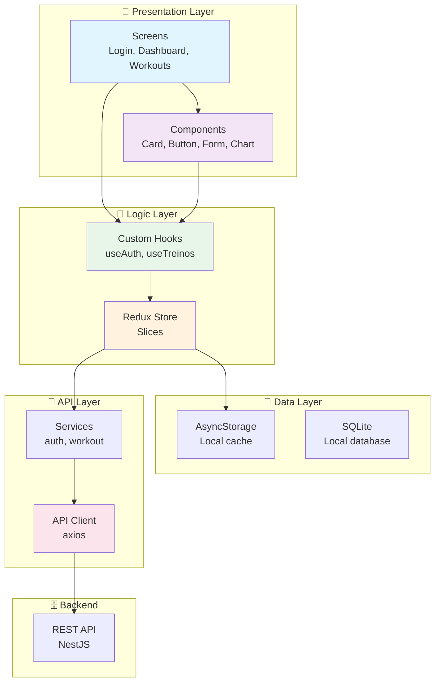

# 📱 CargaLog - Mobile

<div align="center">

[🇧🇷 Português](README.md) | [🇺🇸 English](README_EN.md)

**Native mobile app for iOS and Android - Workout progression tracking**


</div>

---

## 📝 About the Project

The **CargaLog Mobile** is a native app for **iOS** and **Android** developed with **React Native** and **Expo**. It allows users to record, manage, and track their workout progression in a portable and convenient way.

### Main Objective
Provide a complete mobile app for:
- ✅ Quick workout recording
- ✅ Real-time synchronization
- ✅ Offline progress visualization
- ✅ Workout notifications
- ✅ Interactive charts

---

## 🎯 Main Features

### 🔐 Authentication
- Login with email and password
- New user registration
- Biometrics (Face ID, Touch ID)
- Persistent session
- Secure logout

### 🏋️ Workout Recording
- Quick workout creation
- Voice recording (optional)
- Integrated timer
- Workout history
- Edit previous workouts

### 📊 Mobile Dashboard
- Daily summary
- Personal records
- Progression charts
- Quick statistics
- Daily workout widget

### 🔔 Notifications
- Workout reminder
- New record notification
- Weekly progress summary
- Goal achieved alerts

### ⚙️ Settings
- Themes (light/dark)
- Units (kg/lb)
- Language
- Auto sync
- Data backup

---

## 📸 Project Visual Example

<div align="center">
  
  
  
  
</div>

---

## ✔️ Techniques and Technologies Used

### 📱 Mobile Stack
- **React Native** - Mobile framework
- **Expo** - Development platform
- **TypeScript** - Static typing
- **React Navigation** - Navigation
- **Axios** - HTTP client
- **AsyncStorage** - Local storage

### 🎨 UI/UX
- **React Native Paper** - Material Design components
- **React Native SVG** - Vector graphics
- **Recharts** - Advanced charts
- **React Native Gesture Handler** - Gestures

### 📊 Data
- **AsyncStorage** - Local cache
- **Redux** (optional) - State management
- **SQLite** - Local database

### 🔐 Security
- **JWT Storage** - Secure token storage
- **Biometrics** - Biometric authentication
- **Encryption** - Encrypted data
- **HTTPS** - Secure communication

### ✅ Testing & Quality
- **Jest** - Testing framework
- **Detox** - E2E testing
- **ESLint** - Linting

---

## 📊 Architecture Diagram



---

## 📁 Project Structure

```
mobile/
├── app/
│   ├── screens/
│   │   ├── auth/
│   │   │   ├── LoginScreen.tsx
│   │   │   ├── RegisterScreen.tsx
│   │   │   └── SplashScreen.tsx
│   │   │
│   │   ├── main/
│   │   │   ├── DashboardScreen.tsx
│   │   │   ├── TreinosScreen.tsx
│   │   │   ├── TreinoDetailScreen.tsx
│   │   │   ├── AnalisesScreen.tsx
│   │   │   └── ProfileScreen.tsx
│   │   │
│   │   └── modals/
│   │       ├── CreateTreinoModal.tsx
│   │       ├── EditTreinoModal.tsx
│   │       └── SettingsModal.tsx
│   │
│   ├── components/
│   │   ├── common/
│   │   │   ├── Button.tsx
│   │   │   ├── Input.tsx
│   │   │   ├── Card.tsx
│   │   │   └── Loader.tsx
│   │   │
│   │   ├── treino/
│   │   │   ├── TreinoCard.tsx
│   │   │   ├── TreinoForm.tsx
│   │   │   └── TreinoList.tsx
│   │   │
│   │   └── charts/
│   │       ├── ProgressChart.tsx
│   │       ├── LoadChart.tsx
│   │       └── ComparisonChart.tsx
│   │
│   ├── navigation/
│   │   ├── RootNavigator.tsx
│   │   ├── AuthNavigator.tsx
│   │   ├── MainNavigator.tsx
│   │   └── types.ts
│   │
│   ├── api/
│   │   ├── client.ts
│   │   ├── auth.api.ts
│   │   ├── treino.api.ts
│   │   └── analise.api.ts
│   │
│   ├── store/
│   │   ├── index.ts
│   │   ├── authSlice.ts
│   │   ├── treinosSlice.ts
│   │   └── analisesSlice.ts
│   │
│   ├── hooks/
│   │   ├── useAuth.ts
│   │   ├── useTreinos.ts
│   │   └── useAnalises.ts
│   │
│   ├── contexts/
│   │   └── AuthContext.tsx
│   │
│   ├── services/
│   │   ├── storage.service.ts
│   │   ├── notification.service.ts
│   │   └── biometric.service.ts
│   │
│   ├── utils/
│   │   ├── formatters.ts
│   │   ├── validators.ts
│   │   └── constants.ts
│   │
│   ├── styles/
│   │   ├── colors.ts
│   │   ├── fonts.ts
│   │   └── spacing.ts
│   │
│   ├── App.tsx
│   └── app.json
│
├── .env                        # Environment variables
├── .env.example                # .env example
├── package.json                # Dependencies
├── tsconfig.json               # TypeScript config
├── app.json                    # Expo config
└── eas.json                    # EAS Build config
```

---

## 🛠️ How to Open and Run the Project

### 📋 Prerequisites

1. **Node.js 18+**
   ```bash
   node -v
   ```

2. **Expo CLI**
   ```bash
   npm install -g expo-cli
   ```

3. **Simulator or Device**
   - iOS: Xcode Simulator
   - Android: Android Emulator or physical device

### 🚀 Installation and Setup

1. **Clone the repository:**
   ```bash
   git clone <REPOSITORY_URL>
   cd CargaLog/mobile
   ```

2. **Install dependencies:**
   ```bash
   npm install
   # or
   yarn install
   ```

3. **Configure `.env`:**
   ```bash
   cp .env.example .env
   ```

   ```dotenv
   EXPO_PUBLIC_API_URL=http://localhost:3000/api/v1
   ```

4. **Start Expo:**
   ```bash
   expo start
   ```

   **Expected output:**
   ```
   Expo Go (iOS):  exp://127.0.0.1:19000
   Expo Go (Android):  exp://127.0.0.1:19000
   ```

### 📱 Run on Simulator/Emulator

#### iOS (macOS)
```bash
expo start --ios
```

#### Android
```bash
expo start --android
```

#### Expo Go App
```bash
expo start
# Scan QR Code with phone camera
```

---

## 📚 Available Scripts

```bash
# Development
npm run start       # Start Expo
npm run ios         # Open in iOS Simulator
npm run android     # Open in Android Emulator
npm run web         # Open in web

# Build and Deploy
npm run build       # Build for submission
npm run eas:build   # Build with EAS
npm run eas:submit  # Submit to stores

# Tests
npm run test        # Run tests
npm run test:watch  # Watch mode

# Quality
npm run lint        # ESLint
npm run format      # Prettier
npm run type-check  # Check types
```

---

## 🔧 `.env` Configuration

```dotenv
# API
EXPO_PUBLIC_API_URL=http://localhost:3000/api/v1

# Environment
EXPO_PUBLIC_ENV=development
```

---

## 🌐 Deploy

### App Store (iOS)

```bash
# 1. Build
expo run:ios --configuration Release

# 2. Submit
eas submit --platform ios
```

### Google Play (Android)

```bash
# 1. Build
expo run:android --configuration Release

# 2. Submit
eas submit --platform android
```

### EAS Build

```bash
# 1. Connect with Expo
eas build:configure

# 2. Build
eas build --platform all

# 3. Submit
eas submit --platform all
```

---

## 📊 Metrics

| Metric | Status |
|--------|--------|
| iOS Compatibility | 14+ |
| Android Compatibility | 10+ |
| App Size | < 50MB |
| Performance | 60 FPS |
| Test Coverage | 70%+ |

---

## 🤝 Contributing

1. Fork the project
2. Create a branch (`git checkout -b feature/AmazingFeature`)
3. Commit your changes
4. Push to the branch
5. Open a Pull Request

---

## 📄 License

MIT License - see the LICENSE file for details.

---

<div align="center">

**[⬆ Back to top](#-cargalog---mobile)**

Made with ❤️ by developers passionate about clean code

</div>

